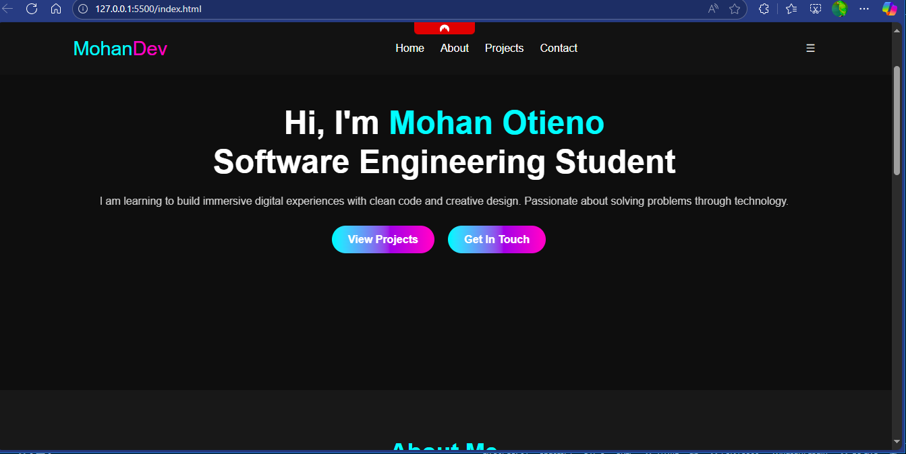

#  Personal Portfolio Website

Welcome to my personal portfolio website! This project showcases who I am, the technologies I’m learning, my projects, and how to get in touch with me. It was built using only HTML5 and CSS3.

##  Live Demo

 [View the Website](https://mohanot.github.io/My_Portfolio/)  

## 🛠 Built With

- **HTML5** – Structure and content
- **CSS3** – Styling and animations
- **Responsive Design** – Mobile-first approach
- **Custom Animations** – Smooth fade-ins, button hovers, and transitions

##  Sections Included

- *Home* – Quick intro and call-to-action
- *About Me* – Who I am, what I do, and my core skills
- *Downloadable CV* – One-click access to my resume
- *Programming Languages* – Technologies I use or am learning
- *Interests* – Topics and areas in tech I’m passionate about
- *Projects* – Sample work with brief descriptions
- *Contact Form* – Simple form to reach me
- *Footer* – Social media and copyright

  ## Portfolio Screenshot

##  Features

- Clean code with comments
- Styled interactive buttons and links
- Image placeholder for profile photo
- Easy navigation via sticky header
